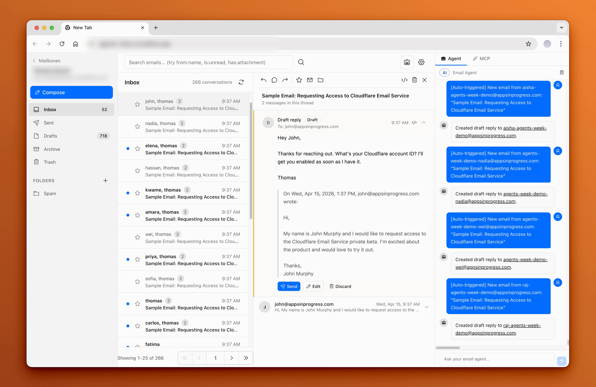

<div align="center">
  <h1>Mailboxes</h1>
  <p><em>用你自己的域名收发邮件 —— 一个完全免费、跑在 Cloudflare 上的自托管邮件客户端，内置 AI 助手。</em></p>

  <p>
    <a href="https://github.com/doforu-labs/Mailboxes/actions/workflows/ci.yml"></a>
    <a href="LICENSE"></a>
    
    <a href="https://github.com/doforu-labs/Mailboxes/pulls"></a>
  </p>

  <a href="https://deploy.workers.cloudflare.com/?url=https://github.com/doforu-labs/Mailboxes"></a>

  

  <p><sub>© 2026 <strong>Doforu</strong> · 派生自 <a href="https://github.com/cloudflare/agentic-inbox">cloudflare/agentic-inbox</a> · 许可与归属详见 <a href="NOTICE">NOTICE</a></sub></p>
</div>

---

> **简体中文** · [English](./README.en.md)

**Mailboxes 运行是免费的。** 没有服务器要租，也没有按人头的费用 —— 整个应用跑在你自己的 Cloudflare 账号和 Resend 免费额度里。个人收件箱或小型产品，每月账单就是 **$0**。

## 为什么用 Mailboxes

给你的产品一个真正属于自己的域名邮箱 —— `support@`、`hello@`、`sales@` —— 用来**收发邮件和自动回复**，而不必为每个邮箱按月付费。

为面向全球用户发布产品的开发者打造：

- **设计上就免费** —— 运行在 Cloudflare 和 Resend 的免费额度内。没有常驻服务器、没有按用户收费、无需绑卡即可开始。→ [成本明细](#成本明细)
- **域名是你的，数据也是你的** —— 邮件存在你自己的 Cloudflare 账号里：邮件正文存于 [D1](https://developers.cloudflare.com/d1/)（SQLite）数据库，邮箱配置与附件存于 [R2](https://developers.cloudflare.com/r2/)。数据不会离开你的账号。
- **送达率有保障** —— 外发邮件经由 [Resend](https://resend.com)，并正确配置 SPF/DKIM/DMARC，能进 Gmail 和 Outlook 的收件箱，而不是垃圾箱。
- **多域名、多邮箱** —— 在一个界面里管理多个域名，以及任意数量的邮箱（例如用一个 catch-all 全收）。
- **AI 收件箱助手** —— 侧边面板内置 **14 个工具**，可读取来信、检索会话、起草回复；发送前始终需要你明确确认。
- **自带模型** —— 默认走 Cloudflare Workers AI（无需 Key），也可按邮箱切换到任意 OpenAI 兼容接口。
- **全球边缘部署** —— Cloudflare 网络在你用户所在的位置就近响应，不用选区域，也不用半夜担心服务掉线。

## 成本明细

| 组件 | 免费额度 | 用途 |
| --- | --- | --- |
| Cloudflare [Workers](https://developers.cloudflare.com/workers/platform/pricing/) | 每天 100,000 次请求 | Web 应用 + API |
| Cloudflare [D1](https://developers.cloudflare.com/d1/platform/pricing/) | 每天 500 万行读取 · 10 万行写入 · 5 GB 存储 | 邮件、会话、文件夹、会话凭证 |
| Cloudflare [R2](https://developers.cloudflare.com/r2/pricing/) | 10 GB 存储 · 每月 100 万 Class A + 1000 万 Class B 操作 · **出站流量免费** | 邮箱配置 + 附件 |
| Cloudflare [Workers AI](https://developers.cloudflare.com/workers-ai/platform/pricing/) | 每天 10,000 Neurons | AI 助手（默认模型提供方） |
| Cloudflare [Email Routing](https://developers.cloudflare.com/email-routing/) | 免费包含 | 接收邮件 |
| [Resend](https://resend.com/pricing) | 每天 100 封（每月 3,000 封） | 发送邮件 |
| **合计** | **每月 $0** | 个人使用与小型产品 |

超出免费额度后，你只为 Cloudflare 和 Resend 实际计量的部分付费 —— 与邮箱数量、用户数量都无关。

## 功能

- **登录保护** —— 首次部署后的第一位访客通过设置向导创建管理员账号，密码以加盐 PBKDF2-SHA256 哈希存于 D1，**没有默认密码**。会话通过 HttpOnly Cookie 保持 7 天，会话数据存在 D1。
- **完整的邮件客户端** —— 通过 Cloudflare Email Routing 收发邮件，支持富文本编辑器、回复/转发会话串、文件夹、搜索与附件。
- **邮箱间相互隔离** —— 每个邮箱的配置是一个 R2 对象，邮件数据按邮箱存于 D1。
- **内置 AI 助手** —— 侧边面板提供 14 个邮件工具，可读取、检索、起草、发送；响应通过 SSE 流式返回，并展示工具调用过程。
- **新邮件自动起草** —— 助手会读取来信并生成草稿，发送前始终需要你明确确认。
- **可配置、可持久化** —— 每个邮箱可自定义系统提示词，聊天记录持久保存，并可单独选择模型提供方。
- **程序化发送** —— 每个邮箱可创建 API Key，让你自己的应用通过 `/api/v1/send` 发信。

## 快速开始

**重要**：**Deploy to Cloudflare** 按钮只会创建 Worker，**它本身并不够用** —— 你必须完成下面的步骤，**尤其是创建 D1 数据库**，应用才能正常工作。

1. **部署到 Cloudflare。** 点击按钮。部署流程会在你的账号里开通 R2 和 Workers AI。

   [](https://deploy.workers.cloudflare.com/?url=https://github.com/doforu-labs/Mailboxes)

2. **创建 D1 数据库并运行迁移。** 仓库里 `wrangler.jsonc` 中的 `database_id` 是原作者的，**必须换成你自己的**：

   ```bash
   wrangler d1 create mailboxes-db
   ```

   把返回的 `database_id` 填进 `wrangler.jsonc` 的 `d1_databases` 块，然后应用迁移：

   ```bash
   npm run db:migrate
   ```

3. **配置收信。** 在 Cloudflare 面板里进入你的域名 → **Email Routing**，创建一条 **catch-all** 规则，转发到该 Worker。（如果域名**不在** Cloudflare DNS 上，也可以改用 Resend 的收信 Webhook：`/api/v1/inbound/resend`。）

4. **配置 Resend 以便发信**（可选 —— 只有需要发信时才要）。在 [resend.com](https://resend.com) 注册、添加你的域名、复制 API Key。然后在应用里添加该域名：**Add Domain** 流程会要求填写 Resend API Key，之后也可以在首页的域名菜单里更新。

5. **创建管理员账号。** 首次打开应用会被直接引导到设置向导（`/setup`），填写用户名（默认 `admin`）和密码即可 —— 在此之前应用不会开放其它页面。**没有默认密码，也不需要 token 或任何环境变量。** 这是一个一次性的窗口：账号建好之后，向导与它的建号接口都会关闭，再提交只会得到 409。

6. **创建一个邮箱。** 登录后，为域名下的任意地址创建邮箱（例如 `hello@yourdomain.com`）。

## 配置

- **`wrangler.jsonc`** —— 设置你的 D1 `database_id`、R2 桶名以及其它绑定。
- **R2 存储桶** —— 应用需要一个名为 `mailboxes` 的桶：
  ```bash
  wrangler r2 bucket create mailboxes
  ```
- **管理员凭证** —— 由首次运行向导（`/setup`）创建一次，存于 D1，无需配置任何凭据变量。向导只在 `admins` 表为空时开放，建号后自动关闭；即使两个请求同时提交，也只有一个能成功，另一个收到 409。想重新开始，删除该行后刷新即可：`wrangler d1 execute mailboxes-db --remote --command "DELETE FROM admins"`。
- **密码存储** —— 管理员密码以加盐 **PBKDF2-SHA256** 哈希存于 D1，迭代 10 万次（workerd 对 PBKDF2 的上限），参数随哈希值一并存储，日后要提高强度无需改表结构。早期版本曾以明文存储，理由是免费版每请求 CPU 上限 10 ms、加上 KDF 会让登录间歇性触发 1102；但在真实免费版部署上实测，CPU 实际上限接近 **2000 ms**，而 KDF 只花 **21–26 ms**，于是改回了哈希。详见 [SECURITY.md](SECURITY.md) 与 [`workers/lib/password.ts`](workers/lib/password.ts)。
- **AI 提供方** —— 助手默认使用 Cloudflare Workers AI，无需 Key。想用自定义模型时，打开某个邮箱的 **Settings → AI Model**，启用开关并填写 Base URL、模型名和 API Key（OpenAI 兼容）。若自定义提供方不可达，会自动回退到 Workers AI。
- **发信** —— Resend API Key 按域名配置。

## 本地开发

1. 克隆仓库并安装依赖：

   ```bash
   npm install
   ```

2. 配置本地环境变量：

   ```bash
   cp .dev.vars.example .dev.vars
   ```

3. 创建 D1 数据库：

   ```bash
   wrangler d1 create mailboxes-db
   ```

4. 把返回的 `database_id` 填进 `wrangler.jsonc` 的 `d1_databases` 数组。

5. 创建 R2 存储桶：

   ```bash
   wrangler r2 bucket create mailboxes
   ```

6. 在本地应用数据库迁移：

   ```bash
   npm run db:migrate:local
   ```

7. 启动开发服务器：

   ```bash
   npm run dev
   ```

### 生产部署

```bash
npm run deploy
```

然后在生产环境应用迁移：

```bash
npm run db:migrate
```

或者用一条命令完成构建、部署和迁移：

```bash
npm run deploy:full
```

## 前置条件

- 一个拥有域名的 Cloudflare 账号
- 启用 [Email Routing](https://developers.cloudflare.com/email-routing/) 用于**收信**
- 一个 [Resend](https://resend.com) 账号用于**发信**（外发邮件不使用 Cloudflare Email Service）
- 启用 [Workers AI](https://developers.cloudflare.com/workers-ai/) 供 AI 助手使用（默认已开启）

## 技术栈

- **前端：** React 19、React Router v7（SSR）、Tailwind CSS v4、Zustand、TipTap、[`@cloudflare/kumo`](https://www.npmjs.com/package/@cloudflare/kumo)、TanStack Query
- **后端：** 运行在 Cloudflare Workers 上的 Hono、[D1](https://developers.cloudflare.com/d1/)（SQLite，经 [Drizzle ORM](https://orm.drizzle.team/)）、[R2](https://developers.cloudflare.com/r2/)、Cloudflare [Email Routing](https://developers.cloudflare.com/email-routing/)
- **AI 助手：** 默认使用 Cloudflare [Workers AI](https://developers.cloudflare.com/workers-ai/)（或任意 OpenAI 兼容接口），支持工具调用与 SSE 流式输出
- **发信：** [Resend](https://resend.com) REST API

## 架构

```text
┌────────────────────────────────────────┐
│  Browser - React SPA                   │
│  email client + AI agent panel         │
└───────────────────┬────────────────────┘
                    │  HTTP / SSE
┌───────────────────▼────────────────────┐
│  Hono Worker  (API + SSR)              │
└───┬────────────────────────────────────┘
    │
    ├──►  D1 (SQLite)    —— 邮件、会话、文件夹
    ├──►  R2             —— 邮箱配置、附件
    ├──►  Workers AI     —— AI 助手默认模型
    ├──►  Resend API     —— 外发邮件
    │
    └──►  收信：Cloudflare Email Routing（catch-all）→ Worker
                 或 Resend 收信 Webhook → POST /api/v1/inbound/resend
```

## 常见问题

### 真的免费吗？

是的，个人使用和小型产品免费。Mailboxes 本身不收取任何费用。应用跑在**你自己的** Cloudflare 账号里，Cloudflare 与 Resend 的免费额度足以覆盖一个个人收件箱或早期产品 —— 具体额度见[成本明细](#成本明细)。没有按人头或按邮箱的收费，所以加第十个邮箱和加第一个一样：不花钱。

### 添加域名时提示 "the domain is registered to another team"

添加域名时，Resend 可能返回：

> Failed to create domain on Resend: The `yourdomain.com` domain is registered to another team. You can claim it using the Domain Claim API.

这个错误来自 **Resend**，不是 Mailboxes。一个域名同一时间只能属于**一个 Resend 团队**，而 `yourdomain.com` 已经在另一个团队里添加过（多半还完成了验证）—— 通常是旧账号、同事的个人账号，或临时测试账号。

**两种修复方式：**

1. **你能控制那个团队** —— 登录那个 Resend 团队，打开 **Domains**，删除该域名，然后从 Mailboxes 重新添加。注意用左上角的团队切换器确认切到了正确的团队。
2. **你无法访问那个团队** —— 通过证明所有权来「认领」域名：
   - **面板：** Domains → **Add Domain** → 输入域名 → **Start claim** → 把返回的 **TXT** 记录加到你的 DNS（部分注册商提供一键添加）→ 点击 **I've added the records**。
   - **API：** `POST https://api.resend.com/domains/claim`，请求体 `{ "name": "yourdomain.com" }`，加上返回的 TXT 记录，然后验证并轮询直到 `status` 变为 `completed`。
   - 认领成功后，域名会**从原团队释放并转入你的团队**。认领请求 **7 天**后过期。
   - 如果认领状态是 `blocked`，原因类似 `recent_owner_activity` 或 `pending_scheduled_emails`，说明对方团队仍在使用该域名发信 —— 请联系 [Resend 支持](https://resend.com/help)释放它。

域名在 Resend 中释放（或认领）后，再从 Mailboxes 应用里重新添加即可。

> **注意：** 这只影响经由 Resend 的**外发**。收信是走 **Cloudflare Email Routing**（catch-all 规则 → 该 Worker），不在 Cloudflare DNS 上的域名则走 Resend 收信 Webhook。请保持域名 MX 记录指向 Cloudflare Email Routing —— 不要把根域 MX 改成 Resend，否则会收不到信。

参考：[Resend — Claim Domain](https://resend.com/docs/api-reference/domains/claim-domain) · [Domain already registered by another account](https://resend.com/docs/knowledge-base/domain-already-registered)

## 路线图

- [ ] 结构化/基于规则**自动回复**（目前仅生成草稿）
- [ ] 团队共享邮箱
- [ ] 除 Resend 之外支持更多发信服务商
- [ ] 轻量联系人/CRM 层

有想法？欢迎提 Issue。

## 贡献

欢迎提 Issue 和 Pull Request。提交 PR 前请先阅读 [CONTRIBUTING.md](CONTRIBUTING.md)，并保持改动聚焦、有测试（`npm test`、`npm run typecheck`）。

## 安全

安全相关问题请勿公开提 Issue —— 请见 [SECURITY.md](SECURITY.md)。

## 许可证

**AGPL-3.0-only** —— 本作品整体（含本仓库的全部新增与修改）以 [GNU Affero General Public License v3.0](LICENSE) 分发。若你把修改后的版本作为网络服务提供给他人使用，你必须向他们提供对应的完整源代码（AGPL 第 13 条）。

本作品是 [cloudflare/agentic-inbox](https://github.com/cloudflare/agentic-inbox) 的派生作品，因此包含上游的 Apache-2.0 代码：上游部分版权归 Cloudflare, Inc. 所有、仍适用 [Apache License 2.0](LICENSE-APACHE)（许可证全文见该文件）；本仓库新增与修改的部分版权归 © 2026 Doforu 所有、适用 AGPL-3.0。各文件的版权与许可声明保留在文件头部。完整归属说明见 [NOTICE](NOTICE)。

## 致谢

本仓库 fork 自 [cloudflare/agentic-inbox](https://github.com/cloudflare/agentic-inbox)。构建于 [Cloudflare Email Routing](https://developers.cloudflare.com/email-routing/)、[D1](https://developers.cloudflare.com/d1/)、[R2](https://developers.cloudflare.com/r2/)、[Workers AI](https://developers.cloudflare.com/workers-ai/) 与 [Resend](https://resend.com)。想了解这种「收件箱」模式的更多内容，可阅读 Cloudflare 博客 [Email for Agents](https://blog.cloudflare.com/email-for-agents/)。
